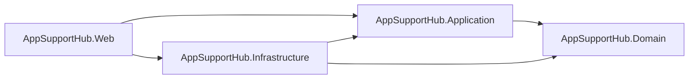

# Architecture

## Goals

AppSupportHub needs a foundation that is easy to explain, test, and extend while
keeping business decisions independent from web and persistence technology. The
architecture prioritizes maintainability, explicit dependencies, secure future
evolution, and deployment as one coherent application.

## Modular Monolith and Clean Architecture

The system is a Modular Monolith: planned business modules remain explicit, but
they build and deploy together. Clean Architecture dependency direction keeps
enterprise rules and use cases inside the core while frameworks and external
resources remain at the edges.

The four production layers have these responsibilities:

- **Domain:** Enterprise concepts and invariant business rules. It has no
  AppSupportHub project dependency.
- **Application:** Use cases, orchestration, validation boundaries, and ports.
  It depends only on Domain.
- **Infrastructure:** Later persistence and external adapter implementations.
  It depends on Application and Domain.
- **Web:** Razor Pages, HTTP endpoints, composition, and presentation. It
  depends on Application and Infrastructure and never directly on Domain.



No other production dependency is permitted. The architecture test project
uses assembly reflection to detect forbidden compiled dependencies and reads
the four production project files to verify their declared references exactly.
Each production assembly exposes a minimal `AssemblyReference` marker so tests
and later composition-oriented tooling can locate it without depending on a
business type.

## Layer rules

Razor Page models translate HTTP input and output and call Application use
cases. They must not contain workflow rules, persistence logic, or domain
decisions. Infrastructure implements technical details selected by Application
contracts; it must not become a second business layer. Keeping business logic
in Domain and Application makes it testable without a web server or database.

## Planned modules and feature organization

Later phases organize work by plural feature or module name rather than by
technical dumping grounds. Planned modules are Systems, WorkItems,
ChangeAssessments, LegacyImports, Reporting, Identity, and Operations.

Representative future organization:

```text
Application/
  Systems/
  WorkItems/
  ChangeAssessments/
  LegacyImports/
  Reporting/
  Identity/
  Operations/

Web/Pages/
  Systems/
  WorkItems/
  ChangeAssessments/
  LegacyImports/
  Reporting/
  Identity/
  Operations/
```

These directories do not exist in Phase 01 because empty feature shells would
misrepresent implemented behavior.

Namespaces follow project and feature folders. Types and files use descriptive
names, one primary top-level type per file, minimal public APIs, and conventional
.NET terminology. Catch-all folders or types named `Helpers`, `Utils`,
`Common`, `Misc`, `Manager`, or `Base` are prohibited unless a later ADR defines
a narrow, specific responsibility.

## Evolution

Feature boundaries allow teams to reason about modules independently while one
process keeps transactions, operations, local development, and deployment
simple. If measured scale or organizational ownership later justifies service
extraction, explicit module contracts provide seams. Microservices are not a
default destination and are unnecessary for the current portfolio scope.

## Phase 01 boundary

The implemented architecture contains project references, assembly markers,
central engineering configuration, reflection-based architecture tests, a
minimal Razor Pages host, and a liveness endpoint. There are no domain entities,
business use cases, persistence adapters, security features, integrations, or
business API endpoints yet.
