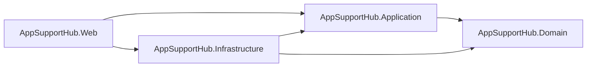
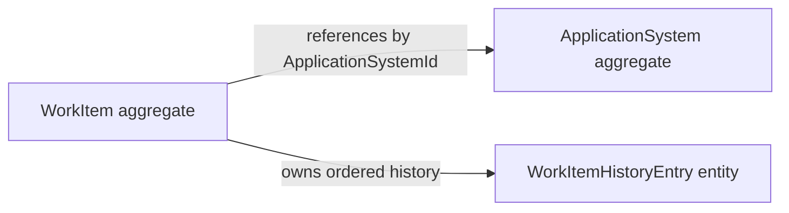

# Architecture

## Goals

AppSupportHub needs a foundation that is easy to explain, test, and extend while
keeping business decisions independent from web and persistence technology. The
architecture prioritizes maintainability, explicit dependencies, secure future
evolution, and deployment as one coherent application.

## Modular Monolith and Clean Architecture

The system is a Modular Monolith: planned business modules remain explicit, but
they build and deploy together. Clean Architecture dependency direction keeps
enterprise rules and use cases inside the core while frameworks and external
resources remain at the edges.

The four production layers have these responsibilities:

- **Domain:** Enterprise concepts and invariant business rules. It has no
  AppSupportHub project dependency.
- **Application:** Use cases, orchestration, validation boundaries, and ports.
  It depends only on Domain.
- **Infrastructure:** EF Core PostgreSQL persistence and later external adapter
  implementations. It depends on Application and Domain.
- **Web:** Razor Pages, HTTP endpoints, composition, and presentation. It
  depends on Application and Infrastructure and never directly on Domain.



No other production dependency is permitted. The architecture test project
uses assembly reflection to detect forbidden compiled dependencies and reads
the four production project files to verify their declared references exactly.
Each production assembly exposes a minimal `AssemblyReference` marker so tests
and later composition-oriented tooling can locate it without depending on a
business type.

## Layer rules

Razor Page models translate HTTP input and output and call Application use
cases. They must not contain workflow rules, persistence logic, or domain
decisions. Infrastructure implements technical details selected by Application
contracts; it must not become a second business layer. Keeping business logic
in Domain and Application makes it testable without a web server or database.

Phase 04B applies the same rule to Minimal API endpoints. Web request contracts
contain primitives only. Feature-specific Application input factories validate
case-insensitive string vocabulary and construct the existing typed commands
and queries; Domain retains all lifecycle and status rules. Application read
models expose computed string labels so Web never references Domain types.

## Systems and WorkItems core

Phase 02 implements two feature-oriented Domain modules:

- **Systems:** `ApplicationSystem` owns classification, ownership, criticality,
  lifecycle, vendor, and retirement invariants.
- **WorkItems:** `WorkItem` owns incident, enhancement, and change-request
  details; assignment, priority, due date, status, resolution, overdue behavior;
  and its immutable history sequence.



ApplicationSystem and WorkItem are separate aggregate boundaries. WorkItem
stores only the application-system ID, so a work-item mutation cannot silently
change system state. Application handlers coordinate cross-aggregate checks,
such as preventing creation for a retired system. WorkItem alone creates and
appends history entries; exposing a read-only collection prevents callers from
rewriting audit facts.

Application defines specific `IApplicationSystemRepository` and
`IWorkItemRepository` ports because each aggregate needs an intentional query
surface and invariant-aware operations. A generic repository would obscure
those differences and encourage unrestricted persistence access. The five use
cases use explicit sealed handlers with `ExecuteAsync`; MediatR and
reflection-based dispatch would add indirection without a current need.

Handlers obtain time from an injected `TimeProvider`. Domain factories and
mutations receive the instant explicitly and normalize stored values to UTC.
This prevents hidden system-clock calls and keeps tests deterministic.

Expected failures use one structured Application error. Stable business-rule
codes introduced in this phase include
`systems.invalid_lifecycle_transition` and
`work_items.assignment_forbidden`; status matrix failures use the specified
`work_items.invalid_transition` code.

## PostgreSQL persistence

Phase 03 implements the two specific repository ports with one scoped
`AppSupportHubDbContext`, which also implements `IUnitOfWork`. A handler and its
repositories therefore share one change tracker and one `SaveChangesAsync`
boundary. Infrastructure uses Npgsql and separate Fluent API configurations;
Domain and Application contain no EF Core attributes or package references.

The relational model contains `application_systems`, `work_items`, and
`work_item_history_entries`. Domain-created GUIDs are never database-generated,
enums are readable constrained strings, and UTC instants use PostgreSQL
`timestamp with time zone`. Application-system names use `citext` for exact,
case-insensitive uniqueness. Named checks enforce trimmed text, enum values,
vendor, retirement, resolution, due-date, timestamp, and positive-sequence
rules. WorkItems restrict physical deletion of their system; history rows use a
database cascade only beneath their owning WorkItem.

Both aggregate tables map PostgreSQL `xmin` as an EF Core row version for
optimistic concurrency. WorkItem history uses its existing `_history` field and
an Infrastructure-only shadow `Sequence`; new rows receive the next value in
Domain append order, including when timestamps match or an aggregate is
reloaded. The DbContext rejects tracked history modifications and deletions
before SQL is issued.

`InitialPostgreSqlPersistence` is the sole migration. Startup does not call
`EnsureCreated` or apply migrations. The standard connection key is
`ConnectionStrings:AppSupportHub`, overridden by
`ConnectionStrings__AppSupportHub`; business-host startup requires it, while
the liveness endpoint itself performs no database query. Integration tests use one isolated
`postgres:17-alpine` Testcontainer, apply migrations, arrange synthetic records,
and truncate between tests. An optional handler-driven synthetic seed runs only
when the environment is Development and `AppSupportHub:SeedDemoData` is true.
It defaults off, is idempotent, never migrates or clears data, and never runs in
other environments.

## Read-query boundary

Phase 04A separates aggregate repositories from presentation-neutral reads.
Application owns `IApplicationSystemQueries`, `IWorkItemQueries`, their bounded
filters, and immutable summary/detail/history models. Handlers validate enum
and limit input, normalize optional text, supply UTC time through
`TimeProvider`, and translate absent records into stable Application errors.
Neither port exposes aggregates, `IQueryable`, EF types, or a DbContext.

Infrastructure implements both ports with scoped EF Core services over the same
DbContext registration as repositories and `IUnitOfWork`. PostgreSQL performs
case-insensitive matching, filtering, deterministic ordering, joins, overdue
calculation, and limits before materialization. Projections use `AsNoTracking`;
WorkItem detail loads only the selected row and its projected history, ordered
by the existing shadow `Sequence` rather than timestamp. All database calls
receive the caller's cancellation token. ADR 0005 records this choice.

## Web composition and adapters

`Program.cs` validates the required connection configuration and delegates
cohesive registration to `AddWebApplication`. It registers every concrete
Application handler and input factory as scoped, registers `TimeProvider.System`
once, calls Infrastructure composition, and maps Razor Pages, `/health`, built-in
OpenAPI, and versioned API groups. It never migrates or creates a database.

Feature folders under `Pages/Systems` and `Pages/WorkItems` own server-rendered
input and output. Forms use server validation, antiforgery, TempData, and
Post/Redirect/Get; successful mutations redirect to canonical detail pages.
UTC is explicit in rendered dates and `datetime-local` values are interpreted
at the Web boundary as UTC. A server-owned synthetic actor is used until Phase
06; no client contract accepts an actor value.

Minimal API feature groups under `Api/V1` expose exactly the Systems and
WorkItems workflows beneath `/api/v1`. Web-owned DTOs serialize string labels
and offset-bearing dates, and cancellation flows to handlers. One Web mapper
translates Application Validation to 400, NotFound to 404, and Conflict or
BusinessRule to 409. API failures use RFC 7807 with the stable Application code
in the `code` extension. Built-in OpenAPI JSON is available at
`/openapi/v1.json`; no interactive documentation package is installed. ADR 0006
records this shared-handler adapter decision.

## Feature organization

Features are organized by plural feature or module name rather than by
technical dumping grounds. Planned later modules are
ChangeAssessments, LegacyImports, Reporting, Identity, and Operations.

Current and representative future organization:

```text
Application/
  Systems/
  WorkItems/
  ChangeAssessments/
  LegacyImports/
  Reporting/
  Identity/
  Operations/

Web/Pages/
  Systems/
  WorkItems/
  ChangeAssessments/
  LegacyImports/
  Reporting/
  Identity/
  Operations/
```

Systems and WorkItems now exist in Domain and Application. The remaining module
directories are not created until they contain behavior, so empty feature
shells cannot misrepresent implemented scope.

Namespaces follow project and feature folders. Types and files use descriptive
names, one primary top-level type per file, minimal public APIs, and conventional
.NET terminology. Catch-all folders or types named `Helpers`, `Utils`,
`Common`, `Misc`, `Manager`, or `Base` are prohibited unless a later ADR defines
a narrow, specific responsibility.

## Evolution

Feature boundaries allow teams to reason about modules independently while one
process keeps transactions, operations, local development, and deployment
simple. If measured scale or organizational ownership later justifies service
extraction, explicit module contracts provide seams. Microservices are not a
default destination and are unnecessary for the current portfolio scope.

## Phase 04 boundary

The implemented architecture now includes the Systems and WorkItems core,
specific PostgreSQL repositories, explicit schema constraints, migrations,
transactions, stable history, optimistic concurrency, bounded read ports, and
the complete non-HTTP Application mutation surface for existing Domain
behavior. Thin Razor Pages and a versioned Minimal API now share those handlers,
with explicit Web input/error/date boundaries and focused real-PostgreSQL HTTP
tests. The host composes the required database connection and optional
Development seed gate but never performs automatic migration.

Authentication, authorization, change assessment, legacy import, reporting,
operational readiness, security hardening, containerization, CI/CD, and
deployment remain later-phase work.
